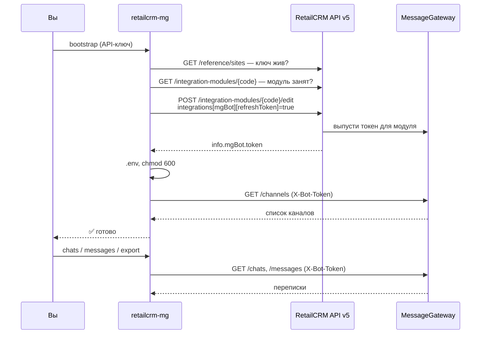

<div align="center">

# RetailCRM MG Connector

**Забирайте переписки из чатов RetailCRM одной командой.**

Коннектор выпускает собственный `mgBot`-токен через RetailCRM API и читает каналы,
чаты, диалоги и сообщения из MessageGateway. Работает с любым аккаунтом RetailCRM:
адреса и коды модулей задаёте вы, в коде ничего не зашито.

[](LICENSE)
[](https://www.python.org/)
[](pyproject.toml)
[](https://github.com/saniq7/RetailCRM-MG-Connector/actions/workflows/ci.yml)

[Быстрый старт](#-быстрый-старт) · [Команды](#-команды) · [Документация](docs/) · [English](README.en.md)

</div>

---

## Зачем это нужно

RetailCRM хранит переписки с клиентами в MessageGateway (MG): WhatsApp, Telegram,
VK, Avito, e-mail — всё в одном месте. Достучаться до них извне можно только
с `mgBot`-токеном, а он не выдаётся в интерфейсе: его выпускает сам RetailCRM,
когда вы регистрируете integration module.

Этот коннектор автоматизирует всю цепочку:

```
API-ключ RetailCRM  →  integration module  →  mgBot-токен  →  чаты и сообщения
```

**Главный принцип:** для каждой интеграции — свой модуль и свой токен.
Не копируйте токен со старого сервера: перевыпуск отзовёт его, и обе интеграции
перестанут работать.

## ✨ Возможности

| | |
|---|---|
| 🔑 **Автовыпуск токена** | `bootstrap` регистрирует integration module и просит RetailCRM выдать свежий `mgBot`-токен через `integrations[mgBot][refreshToken]` |
| 💬 **Чтение переписок** | Каналы, чаты, диалоги, сообщения, клиенты и операторы — с курсорной пагинацией по `since_id` |
| 📦 **Выгрузка** | Экспорт переписок в JSON, JSONL или читаемый Markdown |
| 🩺 **Диагностика** | `doctor` проверяет всю цепочку и говорит, что именно сломалось |
| 🔒 **Безопасность по умолчанию** | Секреты маскируются в выводе и логах, `.env` пишется с `chmod 600`, `apiKey` вырезается из URL в трейсбеках |
| 🪶 **Ноль зависимостей** | Только стандартная библиотека Python 3.9+ — ставится на голый сервер |
| 🌐 **Любой аккаунт** | Ни одного зашитого адреса: облако, своя инсталляция, кастомный домен |
| 🤝 **Не ломает соседей** | Проверяет существующие модули и предупреждает перед перевыпуском чужого токена |

## 🚀 Быстрый старт

```bash
git clone https://github.com/saniq7/RetailCRM-MG-Connector.git
cd RetailCRM-MG-Connector
pip install -e .
```

Выпустите токен, подставив адрес **своего** аккаунта. Ключ спросят интерактивно —
без эха и без попадания в history:

```bash
retailcrm-mg bootstrap --base-url https://crm.example.com
```

```text
✅ RetailCRM: https://crm.example.com
✅ API-ключ принят (Xy7Kd2...9fQa)
✅ integration module создан: mg_connector_prod-01
✅ mgBot-токен выпущен: bWdib3...L3Zx
✅ адрес MessageGateway определён автоматически: https://mg.example.com/api/bot/v1
✅ настройки записаны в /root/.retailcrm-mg/.env (chmod 600)
✅ MG отвечает: доступно каналов — 4
```

> `https://crm.example.com` здесь и дальше — заглушка. Подставьте адрес, по которому
> вы заходите в свою CRM. Хватит и голого хоста: `crm.example.com` превратится
> в `https://crm.example.com`, а лишний `/api/v5` в конце будет отрезан.

Проверьте связку и читайте переписки:

```bash
retailcrm-mg doctor
retailcrm-mg channels
retailcrm-mg chats --limit 20
retailcrm-mg messages --chat-id 12345
retailcrm-mg export --out ./export --format md --limit 50
```

> **Нужен API-ключ RetailCRM** с правами на чтение и запись integration modules
> (`/api/integration-modules/{code}/edit`). Создаётся в
> *Настройки → Интеграция → Ключи доступа к API*. Ключ нужен только для `bootstrap` —
> дальше коннектор работает с одним `mgBot`-токеном.

Адрес MessageGateway коннектор берёт из ответа RetailCRM. Если ваша версия CRM
его не возвращает, укажите вручную — токен при этом уже сохранён:

```bash
retailcrm-mg doctor --mg-api-base https://mg.example.com/api/bot/v1
```

## 🧭 Как это работает



Подробнее — в [docs/architecture.md](docs/architecture.md).

## 📟 Команды

| Команда | Что делает |
|---|---|
| `bootstrap` | Регистрирует integration module и выпускает `mgBot`-токен, сохраняет всё в `.env` |
| `doctor` | Проверяет конфиг, ключ RetailCRM и доступ к MG; ненулевой код возврата при проблеме |
| `config` | Показывает эффективную конфигурацию с замаскированными секретами |
| `modules` | Список integration modules аккаунта — чтобы не затереть чужой |
| `channels` | Подключённые каналы MG |
| `chats` | Чаты, опционально по каналу: `--channel-id` |
| `dialogs` | Диалоги, опционально по чату: `--chat-id` |
| `messages` | Сообщения по `--chat-id`, `--dialog-id` или `--channel-id` |
| `export` | Выгрузка переписок в файлы: `--format json\|jsonl\|md` |

Любая команда листинга понимает `--json` — удобно для `jq` и скриптов:

```bash
retailcrm-mg chats --json | jq '.[] | {id, customer: .customer.name}'
```

Полный справочник — [docs/cli.md](docs/cli.md).

## 🐍 Использование как библиотеки

```python
from retailcrm_mg import Config, MgClient
from retailcrm_mg.export import fetch_transcripts, to_markdown

config = Config.load()
client = MgClient(config.require_mg_api_base(), config.require_bot_token())

for channel in client.channels():
    print(channel["id"], channel["type"], channel.get("name"))

for transcript in fetch_transcripts(client, limit=5, messages_per_chat=200):
    print(to_markdown(transcript))
```

Готовые примеры лежат в [`examples/`](examples/).

## ⚙️ Конфигурация

Приоритет: значения по умолчанию → `.env` → переменные окружения → флаги CLI.

| Переменная | Назначение | По умолчанию |
|---|---|---|
| `RETAILCRM_BASE_URL` | Адрес вашего аккаунта RetailCRM | **обязательно** |
| `RETAILCRM_API_KEY` | API-ключ; нужен только для `bootstrap` | **обязательно для `bootstrap`** |
| `RETAILCRM_MG_API_BASE` | База MG Bot API вашего аккаунта | определяется при `bootstrap` |
| `RETAILCRM_MG_BOT_TOKEN` | Токен бота (`X-Bot-Token`) | выпускается при `bootstrap` |
| `RETAILCRM_MG_MODULE_CODE` | `integrationModule.code` | `mg_connector_<hostname>` |
| `RETAILCRM_MG_MODULE_NAME` | Отображаемое имя модуля | `MG connector <hostname>` |
| `RETAILCRM_MG_CLIENT_ID` | `integrationModule.clientId` | `mg-connector-<hostname>` |
| `RETAILCRM_MG_ENV_FILE` | Путь к `.env` | `~/.retailcrm-mg/.env` |
| `RETAILCRM_MG_TIMEOUT` | Таймаут HTTP, секунды | `30` |

Шаблон — [`.env.example`](.env.example). Адресов по умолчанию у коннектора нет:
они у каждого аккаунта свои, а молчаливая подстановка чужого хоста — худшее,
что может сделать инструмент, работающий с перепиской клиентов.

## 🔐 Безопасность

- Токены и ключи **никогда** не печатаются целиком — только `abc123...wxyz`.
- `apiKey` вырезается из URL в логах и сообщениях об ошибках.
- `.env` создаётся с правами `0600`.
- Ключ можно не хранить: `bootstrap` спросит его интерактивно, минуя shell history.
- Перед перевыпуском токена коннектор предупредит, если модуль уже используется.

Нашли уязвимость — см. [SECURITY.md](SECURITY.md).

## 🩹 Если что-то не работает

| Симптом | Причина и решение |
|---|---|
| `403` при `bootstrap` | У ключа нет прав на integration modules — выдайте их в настройках RetailCRM |
| `404` при `bootstrap` | Проверьте `--base-url`: это должен быть адрес именно вашего аккаунта |
| `не задан адрес MessageGateway` | RetailCRM не вернул адрес MG — укажите `--mg-api-base` |
| Токен не вернулся | К аккаунту не подключён MessageGateway; запустите `bootstrap --dump-response` |
| `401` от MG | Токен отозван перевыпуском на другом сервере — сделайте `bootstrap --refresh` |
| Пустой список каналов | Каналы не активированы в RetailCRM |

Разбор по шагам — [docs/troubleshooting.md](docs/troubleshooting.md).

## 🛠 Разработка

```bash
pip install -e ".[dev]"
pytest          # тесты, сеть не нужна
ruff check .    # линтер
```

Тесты работают на подменном HTTP-клиенте, реальные запросы не выполняются.
Как присылать изменения — [CONTRIBUTING.md](CONTRIBUTING.md).

## 📦 Версионирование

Проект следует [семантическому версионированию](https://semver.org/lang/ru/).
Единственный источник версии — `retailcrm_mg.__version__`; `pyproject.toml`
читает её оттуда.

| Часть версии | Когда растёт |
|---|---|
| **MAJOR** | Несовместимые изменения CLI, имён переменных окружения или публичного API |
| **MINOR** | Новые команды и возможности без ломки существующих |
| **PATCH** | Исправления, не меняющие поведение |

Публичным API считаются: команды и флаги `retailcrm-mg`, переменные `RETAILCRM_*`,
классы `Config`, `MgClient`, `RetailCrmClient` и функции модуля `export`.

Релизы помечаются тегами `vX.Y.Z`; тег запускает сборку и публикацию GitHub Release.
Что изменилось в каждой версии — в [CHANGELOG.md](CHANGELOG.md).

## 🗺 Планы

- [ ] Webhook-приёмник входящих сообщений MG
- [ ] Отправка ответов в чаты (`POST /messages`)
- [ ] Инкрементальная синхронизация с сохранением курсора
- [ ] Docker-образ и unit для systemd

## 👥 Авторы

- [@saniq7](https://github.com/saniq7)
- [@capelancrm](https://github.com/capelancrm)

Как участвовать — [CONTRIBUTING.md](CONTRIBUTING.md).

## 📄 Лицензия

[MIT](LICENSE) © saniq7
